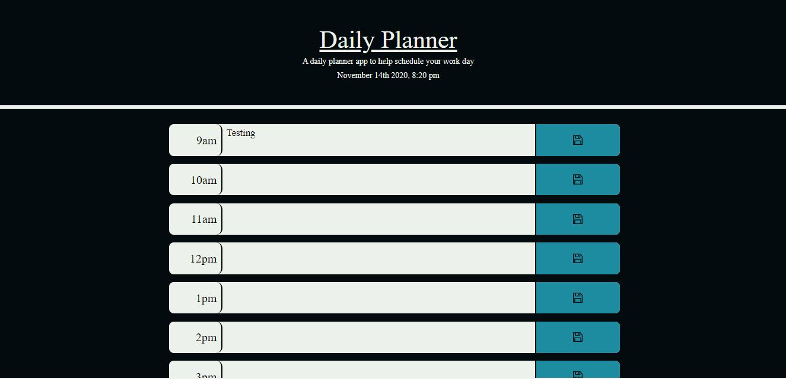

# Daily_Planner
Summary
This application is a simple day planner that allows the user to save events for each hour of the day. This application feature's dynamically updated HTML and CSS. The app display's standard business hours (9 a.m. to 5 p.m.) along the left hand side of each input row. Depending on the time of day, the schedule fields update their color indicating to the user whether items are in the past, present or future.

Here's a screenshot of the application:
